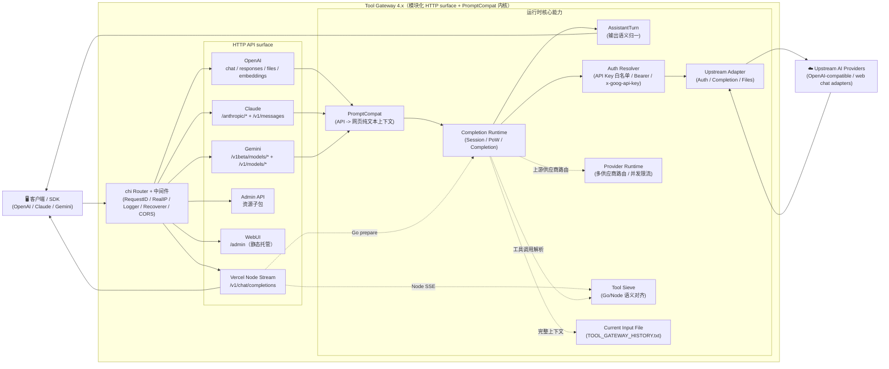

<p align="center">
  
</p>

# Tool Gateway

<a href="https://trendshift.io/repositories/24508" target="_blank"></a>

[](LICENSE)


[](https://github.com/extheor-next/tool-gateway/releases)
[](docs/DEPLOY.md)

[](https://zeabur.com/templates/L4CFHP)
[](https://vercel.com/new/clone?repository-url=https://github.com/extheor-next/tool-gateway)

语言 / Language: [中文](README.MD) | [English](README.en.md)

Tool Gateway 是一个面向 AI 大模型工具调用的通用网关项目：它把不同上游 AI 供应商（OpenAI、Claude、Gemini 等）统一封装成标准协议接口，并提供工具调用解析、流式输出、鉴权、多供应商管理、管理台和部署能力。核心后端以 **Go** 实现，Vercel 流式桥接额外使用少量 Node Runtime，前端为 React WebUI 管理台（源码在 `webui/`，部署时自动构建到 `static/admin`）。

文档入口：[文档导航](docs/README.md) / [架构说明](docs/ARCHITECTURE.md) / [接口文档](API.md)

> **重要免责声明**
>
> 本仓库仅供学习、研究、个人实验和内部验证使用，不提供任何形式的商业授权、适用性保证或结果保证。
>
> 作者及仓库维护者不对因使用、修改、分发、部署或依赖本项目而产生的任何直接或间接损失、账号封禁、数据丢失、法律风险或第三方索赔负责。
>
> 请勿将本项目用于违反服务条款、协议、法律法规或平台规则的场景。商业使用前请自行确认 `LICENSE`、相关协议以及你是否获得了作者的书面许可。

## 目录

- [架构概览（摘要）](#架构概览摘要)
- [核心能力](#核心能力)
- [平台兼容矩阵](#平台兼容矩阵)
- [模型支持](#模型支持)
  - [OpenAI 接口](#openai-接口get-v1models)
  - [Claude 接口](#claude-接口get-anthropicv1models)
  - [Gemini 接口](#gemini-接口)
- [快速开始](#快速开始)
  - [方式一：下载 Release 构建包](#方式一下载-release-构建包)
  - [方式二：Docker 运行](#方式二docker-运行)
  - [方式三：Vercel 部署](#方式三vercel-部署)
  - [方式四：本地源码运行](#方式四本地源码运行)
- [配置说明](#配置说明)
- [鉴权模式](#鉴权模式)
- [Tool Call 适配](#tool-call-适配)
- [本地开发抓包工具](#本地开发抓包工具)
- [文档索引](#文档索引)
- [测试](#测试)
- [Release 自动构建（GitHub Actions）](#release-自动构建github-actions)
- [免责声明](#免责声明)

## 架构概览（摘要）



详细架构拆分与目录职责见 [docs/ARCHITECTURE.md](docs/ARCHITECTURE.md)。

- **后端**：Go（`cmd/tool-gateway/`、`api/`、`internal/`），不依赖 Python 运行时
- **前端**：React 管理台（`webui/`），运行时托管静态构建产物
- **部署**：本地运行、Docker、Vercel Serverless、Linux systemd

## 核心能力

| 能力 | 说明 |
| --- | --- |
| OpenAI 兼容 | `GET /v1/models`、`GET /v1/models/{id}`、`POST /v1/chat/completions`、`POST /v1/responses`、`GET /v1/responses/{response_id}`、`POST /v1/embeddings`、`POST /v1/files`、`GET /v1/files/{file_id}` |
| Claude 兼容 | `GET /anthropic/v1/models`、`POST /anthropic/v1/messages`、`POST /anthropic/v1/messages/count_tokens`（及快捷路径 `/v1/messages`、`/messages`） |
| Gemini 兼容 | `POST /v1beta/models/{model}:generateContent`、`POST /v1beta/models/{model}:streamGenerateContent`（及 `/v1/models/{model}:*` 路径） |
| Ollama 兼容 | `GET /api/version`、`GET /api/tags`、`POST /api/show` |
| 统一 CORS 兼容 | `/v1/*`、`/anthropic/*`、`/v1beta/models/*`、`/api/*`、`/admin/*` 统一走同一套 CORS 策略；Vercel 上 `/v1/chat/completions` 的 Node Runtime 也对齐相同放行规则，尽量减少第三方预检请求头限制 |
| 多供应商管理 | 支持多个上游 AI 供应商（OpenAI / Claude / Gemini 等），可设置活跃供应商及每供应商并发限制 |
| 上游适配器 | 支持 OpenAI-compatible upstream，自动探测供应商模式（Auto/OpenAI/Claude/Gemini） |
| Tool Calling | 防泄漏处理：非代码块高置信特征识别、`delta.tool_calls` 早发、结构化增量输出 |
| Admin API | 配置管理、运行时设置热更新、代理管理、导入导出、Vercel 同步、版本检查 |
| WebUI 管理台 | `/admin` 单页应用（中英文双语、深色模式，支持查看服务器端对话记录） |
| 运维探针 | `GET /healthz`（存活）、`GET /readyz`（就绪） |

OpenAI `/v1/*` 仍是推荐的规范路径；同时支持 `/models`、`/chat/completions`、`/responses`、`/embeddings`、`/files`、`/files/{file_id}` 等根路径快捷路由，方便只配置 Tool Gateway 根地址的第三方客户端。

## 平台兼容矩阵

| 级别 | 平台 | 当前状态 |
| --- | --- | --- |
| P0 | Codex CLI/SDK（`wire_api=chat` / `wire_api=responses`） | ✅ |
| P0 | OpenAI SDK（JS/Python，chat + responses） | ✅ |
| P0 | Vercel AI SDK（openai-compatible） | ✅ |
| P0 | Anthropic SDK（messages） | ✅ |
| P0 | Google Gemini SDK（generateContent） | ✅ |
| P1 | LangChain / LlamaIndex / OpenWebUI（OpenAI 兼容接入） | ✅ |

## 模型支持

Tool Gateway 的模型层以“客户端模型名 → 上游模型名”的 alias 规则为核心：

- 客户端可以继续使用常见模型名，例如 `gpt-*`、`claude-*`、`gemini-*` 或自定义业务模型名。
- `config.example.json` 中的 `model_aliases` 决定最终转发到哪个上游模型。
- `/v1/models` 返回当前网关暴露给客户端的模型列表；不同上游适配器可以按自己的能力补充 thinking、search、vision 等特性。
- OpenAI、Claude、Gemini 三类入口共享同一套模型 alias 与 Tool Calling 语义，便于客户端无缝切换协议。

## 快速开始

### 部署方式优先级建议

推荐按以下顺序选择部署方式：

1. **下载 Release 构建包运行**：最省事，产物已编译完成，最适合大多数用户。
2. **Docker / GHCR 镜像部署**：适合需要容器化、编排或云环境部署。
3. **Vercel 部署**：适合已有 Vercel 环境且接受其平台约束的场景。
4. **本地源码运行 / 自行编译**：适合开发、调试或需要自行修改代码的场景。

### 通用第一步（所有部署方式）

把 `config.json` 作为唯一配置源（推荐做法）：

```bash
cp config.example.json config.json
# 编辑 config.json
```

后续部署建议：
- 本地运行：直接读取 `config.json`
- Docker / Vercel：由 `config.json` 生成 `TOOL_GATEWAY_CONFIG_JSON`（Base64）注入环境变量，也可以直接写原始 JSON

WebUI 管理台里的“全量配置模板”也直接复用同一份 `config.example.json`，所以更新示例文件后，前端模板会自动保持一致。

### 方式一：下载 Release 构建包

每次发布 Release 时，GitHub Actions 会自动构建多平台二进制包：

```bash
# 下载对应平台的压缩包后
tar -xzf tool-gateway_<tag>_linux_amd64.tar.gz
cd tool-gateway_<tag>_linux_amd64
cp config.example.json config.json
# 编辑 config.json
./tool-gateway
```

### 方式二：Docker 运行

```bash
# 1. 准备环境变量和配置文件
cp .env.example .env
cp config.example.json config.json

# 2. 编辑 .env（至少设置 TOOL_GATEWAY_ADMIN_KEY；如需修改宿主机端口，可额外设置 TOOL_GATEWAY_HOST_PORT）
#    TOOL_GATEWAY_ADMIN_KEY=请替换为强密码

# 3. 启动
docker-compose up -d

# 4. 查看日志
docker-compose logs -f
```

默认 `docker-compose.yml` 会把宿主机 `6011` 映射到容器内的 `5001`。如果你希望直接对外暴露 `5001`，请设置 `TOOL_GATEWAY_HOST_PORT=5001`（或者手动调整 `ports` 配置）。
同时默认把 `./config.json` 挂载到容器 `/data/config.json`，并设置 `TOOL_GATEWAY_CONFIG_PATH=/data/config.json`，用于避免 `/app` 只读导致运行时 token 持久化失败。
镜像会预创建 `/data` 并授权给非 root 的 `tool-gateway` 用户；如果使用单文件 bind mount，请确保宿主机 `config.json` 对容器用户可读写，例如 `chmod 644 config.json`。

更新镜像：`docker-compose up -d --build`

#### Zeabur 一键部署（Dockerfile）

1. 点击上方 “Deploy on Zeabur” 按钮，一键部署。
2. 部署完成后访问 `/admin`，使用 Zeabur 环境变量/模板指引中的 `TOOL_GATEWAY_ADMIN_KEY` 登录。
3. 在管理台导入/编辑配置（会写入并持久化到 `/data/config.json`）。

Zeabur 首次空卷启动时可以没有 `/data/config.json`；Tool Gateway 会先使用空的文件模式配置启动，并在管理台首次保存时创建该文件。

不依赖模板手动部署时，在 Zeabur 中选择 GitHub 仓库服务，Root Directory 保持 `/`，使用仓库根目录 `Dockerfile` 构建；添加持久卷 `/data`，设置 `PORT=5001`、`TOOL_GATEWAY_ADMIN_KEY=你的强密钥`、`TOOL_GATEWAY_CONFIG_PATH=/data/config.json`，然后暴露 HTTP 端口 `5001`。更完整步骤见 [docs/DEPLOY.md](docs/DEPLOY.md#不使用模板手动部署)。

说明：Zeabur 使用仓库内 `Dockerfile` 直接构建时，不需要额外传入 `BUILD_VERSION`；镜像会优先读取该构建参数，未提供时自动回退到仓库根目录的 `VERSION` 文件。

### 方式三：Vercel 部署

1. Fork 仓库到自己的 GitHub
2. 在 Vercel 上导入项目
3. 配置环境变量（最少设置 `TOOL_GATEWAY_ADMIN_KEY`；推荐同时设置 `TOOL_GATEWAY_CONFIG_JSON`）
4. 部署

建议先在仓库目录复制模板并填写：

```bash
cp config.example.json config.json
# 编辑 config.json
```

推荐：先本地把 `config.json` 转成 Base64，再粘贴到 `TOOL_GATEWAY_CONFIG_JSON`，避免 JSON 格式错误：

```bash
base64 < config.json | tr -d '\n'
```

> **流式说明**：OpenAI Chat 流式在 Vercel 上会由 `api/chat-stream.js`（Node Runtime）承接，但 `vercel.json` 只把规范路径 `/v1/chat/completions` 重写到 Node；根路径快捷别名 `/chat/completions` 仍走 Go 主链路。鉴权、账号选择、会话/PoW 准备仍由 Go 内部 prepare 接口完成；流式响应（含 `tools`）在 Node 侧执行与 Go 对齐的输出组装与防泄漏处理。Vercel 上需要实时流式时请使用 `/v1/chat/completions`。

详细部署说明请参阅 [部署指南](docs/DEPLOY.md)。

### 方式四：本地源码运行

**前置要求**：Go 1.26+，Node.js `20.19+` 或 `22.12+`（仅在需要构建 WebUI 时；CI / Docker 构建使用 Node 24）；同时确保 `npm` 可用，建议 `npm 10+`

```bash
# 1. 克隆仓库
git clone https://github.com/extheor-next/tool-gateway.git
cd tool-gateway

# 2. 配置
cp config.example.json config.json
# 编辑 config.json，填入上游供应商配置和客户端 API key

# 3. 启动
go run ./cmd/tool-gateway
```

默认本地访问地址：`http://127.0.0.1:5001`

服务实际绑定：`0.0.0.0:5001`，因此同一局域网设备通常也可以通过你的内网 IP 访问。

> **WebUI 自动构建**：本地首次启动时，若 WebUI 静态目录不存在，会自动尝试执行 `npm ci --prefix webui`（仅在缺少依赖时）和 `npm run build --prefix webui -- --outDir static/admin --emptyOutDir`（需要本机有 Node.js 和 npm；静态目录可用 `TOOL_GATEWAY_STATIC_ADMIN_DIR` 覆盖）。你也可以手动构建：`./scripts/build-webui.sh`

## 配置说明

`README` 只保留快速入口，完整字段请以 [config.example.json](config.example.json) 为模板，并参考 [部署指南](docs/DEPLOY.md#0-前置要求) 与 [API 配置最佳实践](API.md#配置最佳实践)。

常用字段：

- `keys` / `api_keys`：客户端访问密钥，`api_keys` 支持 `name` 与 `remark` 元信息，`keys` 继续兼容。
- `external_ai`：单个上游 AI 供应商配置（base_url、api_key、model、mode）。
- `external_ai_providers`：多供应商配置，支持 active 选择和 per-provider 并发限制。
- `model_aliases`：OpenAI / Claude / Gemini 共用的模型 alias 映射。
- `runtime`：全局并发上限，可通过 Admin Settings 热更新。
- `auto_delete.mode`：请求结束后的远端会话清理策略，支持 `none` / `single` / `all`。
- `current_input_file`：全局生效的上下文拆分上传策略；默认开启且阈值为 `0`，触发时将完整上下文合并上传为 `TOOL_GATEWAY_HISTORY.txt` 上下文文件。
- 如果关闭 `current_input_file`，请求会直接透传，不上传拆分上下文文件。
- `thinking_injection`：默认开启；在最新 user 消息末尾追加思考增强提示词，提高高强度推理与工具调用前的思考稳定性；`prompt` 留空时使用内置默认提示词。

环境变量完整列表见 [部署指南](docs/DEPLOY.md)，接口鉴权规则见 [API.md](API.md#鉴权规则)。

## 鉴权模式

调用业务接口（`/v1/*`、`/anthropic/*`、Gemini 路由）时，通过 `Bearer` 或 `x-api-key` 传入 `config.keys` 中的 key 进行认证。不在白名单中的 key 返回 `401 invalid api key`。

Gemini 路由还可以使用 `x-goog-api-key`，或在没有认证头时使用 `?key=` / `?api_key=` 作为调用方凭据。

## 并发模型

网关支持两级并发控制：

- **供应商级**：每个供应商可独立配置 `max_inflight`（并发上限）和 `max_queue`（等待队列上限），0 表示不限制
- **全局级**：`runtime.global_max_inflight` 控制网关整体并发上限

单供应商并发满时进入等待队列，全部满载后返回 `429 Too Many Requests`。

## Tool Call 适配

当请求中带 `tools` 时，Tool Gateway 会做防泄漏处理与结构化转译：

1. 只在**非 Markdown 代码上下文**启用执行型 toolcall 识别（fenced code block 和行内 code span 中的示例默认不触发）
2. 解析层当前把半角管道符 DSML 外壳视为推荐可执行调用：`<|DSML|tool_calls>` → `<|DSML|invoke name="...">` → `<|DSML|parameter name="...">`；兼容旧式 canonical XML `<tool_calls>` → `<invoke name="...">` → `<parameter name="...">`，以及若干 DSML 前缀/分隔符漂移。DSML 只是外壳别名，内部仍以 XML 解析语义为准；旧式 `<tools>` / `<tool_call>` / `<tool_name>` / `<param>`、`<function_call>`、`tool_use` / antml 变体与纯 JSON `tool_calls` 片段都会按普通文本处理，完整但 malformed 的 wrapper 也会作为普通文本释放
3. `responses` 流式严格使用官方 item 生命周期事件（`response.output_item.*`、`response.content_part.*`、`response.function_call_arguments.*`）
4. `responses` 支持并执行 `tool_choice`（`auto`/`none`/`required`/强制函数）；`required` 违规时非流式返回 `422`，流式返回 `response.failed`
5. 客户端请求哪种协议，就按该协议返回工具调用（OpenAI/Claude/Gemini 各自原生结构）；模型侧优先约束输出规范 XML，再由兼容层转译

> 说明：当前版本 parser 层以”尽量解析成功”为优先，所有格式合法的 XML 工具调用都会通过，不做工具名 allow-list 过滤。
> 解析层会保留显式空字符串或纯空白参数；Prompt 会要求模型不要主动输出空参数，缺参/空命令的拒绝应由工具执行侧或客户端 schema 校验负责。
>
> 想评估”把工具调用封装成 XML 再输入模型”的方案，可参考：`docs/toolcall-semantics.md`。

## 本地开发抓包工具

用于定位「responses 思考流/工具调用」等问题。开启后会自动记录最近 N 条上游对话请求体与响应体（默认 20 条，超出自动淘汰；单条响应体默认最多记录 5 MB）。

启用示例：

```bash
TOOL_GATEWAY_DEV_PACKET_CAPTURE=true \
TOOL_GATEWAY_DEV_PACKET_CAPTURE_LIMIT=20 \
go run ./cmd/tool-gateway
```

查询/清空（需 Admin JWT）：

- `GET /admin/dev/captures`：查看抓包列表（最新在前）
- `DELETE /admin/dev/captures`：清空抓包
- `GET /admin/dev/raw-samples/query?q=关键词&limit=20`：按问题关键词查询当前内存抓包，并按 `chat_session_id` 归并 `completion + continue` 链
- `POST /admin/dev/raw-samples/save`：把命中的某条抓包链保存为 `tests/raw_stream_samples/<sample-id>/` 回放样本

返回字段包含：

- `request_body`：发送给上游适配器的完整请求体
- `response_body`：上游返回的原始流式内容拼接文本
- `response_truncated`：是否触发单条大小截断

保存接口支持用 `query`、`chain_key` 或 `capture_id` 选中目标。例如：

```json
{"query":"广州天气","sample_id":"gz-weather-from-memory"}
```

## 文档索引

| 文档 | 说明 |
| --- | --- |
| [API.md](API.md) / [API.en.md](API.en.md) | API 接口文档（含请求/响应示例） |
| [DEPLOY.md](docs/DEPLOY.md) / [DEPLOY.en.md](docs/DEPLOY.en.md) | 部署指南（本地/Docker/Vercel/systemd） |
| [CONTRIBUTING.md](docs/CONTRIBUTING.md) / [CONTRIBUTING.en.md](docs/CONTRIBUTING.en.md) | 贡献指南 |
| [TESTING.md](docs/TESTING.md) | 测试集使用指南 |

## 测试

详细测试指南请参阅 [docs/TESTING.md](docs/TESTING.md)。

### 快速测试命令

```bash
# 本地 PR 门禁
./tests/scripts/check-local-gates.sh

# 端到端全链路测试（真实账号，生成完整请求/响应日志）
./tests/scripts/run-live.sh
```

## Release 自动构建（GitHub Actions）

工作流文件：`.github/workflows/release-artifacts.yml`

- **触发条件**：默认仅在 GitHub Release `published` 时自动触发；也支持在 Actions 页面手动 `workflow_dispatch`，并填写 `release_tag` 复跑/补发
- **构建产物**：多平台二进制包（`linux/amd64`、`linux/arm64`、`linux/armv7`、`darwin/amd64`、`darwin/arm64`、`windows/amd64`、`windows/arm64`）、Linux Docker 镜像导出包 + `sha256sums.txt`
- **容器镜像发布**：仅推送到 GHCR（`ghcr.io/extheor-next/tool-gateway`）
- **每个二进制压缩包包含**：`tool-gateway` 可执行文件、`static/admin`、`config.example.json`、`.env.example`、`README.MD`、`README.en.md`、`LICENSE`

## 免责声明

本项目仅供学习、研究、个人实验和内部验证使用，不提供任何商业授权、稳定性保证或可用性保证。
作者及仓库维护者不对因使用、修改、分发、部署或依赖本项目而产生的任何直接或间接损失、账号封禁、数据丢失、法律风险或第三方索赔负责。

请勿将本项目用于违反服务条款、协议、法律法规或平台规则的场景。商业使用前请自行确认 `LICENSE`、相关协议以及你是否获得了作者的书面许可。

## Star History

<a href="https://www.star-history.com/?repos=extheor-next%2Ftool-gateway&type=date&legend=top-left">
 <picture>
   <source media="(prefers-color-scheme: dark)" srcset="https://api.star-history.com/chart?repos=extheor-next/tool-gateway&type=date&theme=dark&legend=top-left" />
   <source media="(prefers-color-scheme: light)" srcset="https://api.star-history.com/chart?repos=extheor-next/tool-gateway&type=date&legend=top-left" />
   
 </picture>
</a>
